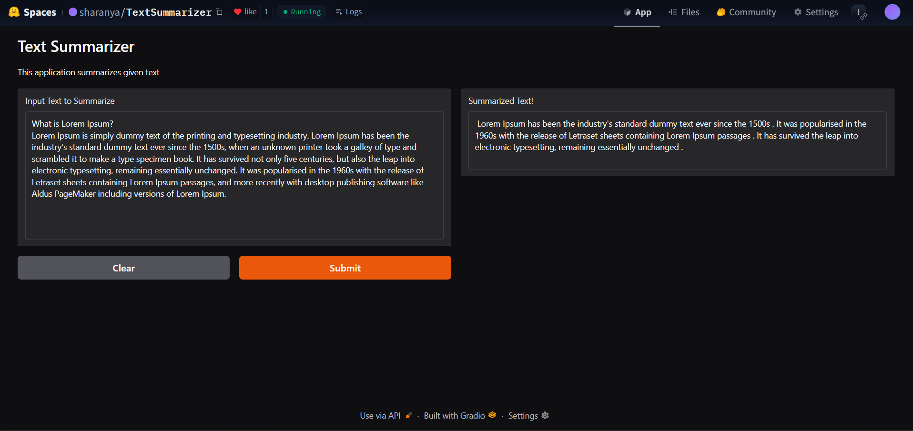

# 📝 Text Summarizer App

This is a simple web application that summarizes long text into a concise version using a transformer-based model. Built with Hugging Face Transformers and Gradio, it makes it easy to get quick summaries right from your browser.

---

## ✨ Features

- 🧠 Summarizes long paragraphs into short, meaningful summaries
- ⚡ Powered by the DistilBART transformer model
- 🧱 Easy-to-use web interface via Gradio
- 💻 Runs locally, no internet connection required after setup

---

## 🛠️ Tech Stack

| Tool            | Purpose                             |
|------------------|-------------------------------------|
| Python           | Core programming language           |
| Transformers     | Pre-trained summarization model     |
| Gradio           | Web interface                       |
| PyTorch          | Deep learning backend               |

---

## 🚀 Setup Instructions

### 1. Clone the repository

```bash
git clone https://github.com/Sharanya-krishnamurthi/TextSummarizerApp.git
cd TextSummarizerApp
````

### 2. Install dependencies

```bash
pip install -r requirements.txt
```

### 3. Run the app

```bash
python app.py
```

Then open the Gradio interface in your browser and start summarizing!


---

## 💡 Example

**Input:**

> Artificial intelligence (AI) refers to the simulation of human intelligence in machines...

**Output:**

> AI is the simulation of human intelligence in machines.

---

## 🧠 Model Used

* **Model**: `sshleifer/distilbart-cnn-12-6`
* **Type**: Abstractive summarization model based on Facebook's BART
* **Source**: Hugging Face Transformers

---

## 🖼️ Screenshot



---

## 📜 Demo
[HuggingFace Spaces](https://huggingface.co/spaces/sharanya/TextSummarizer)

